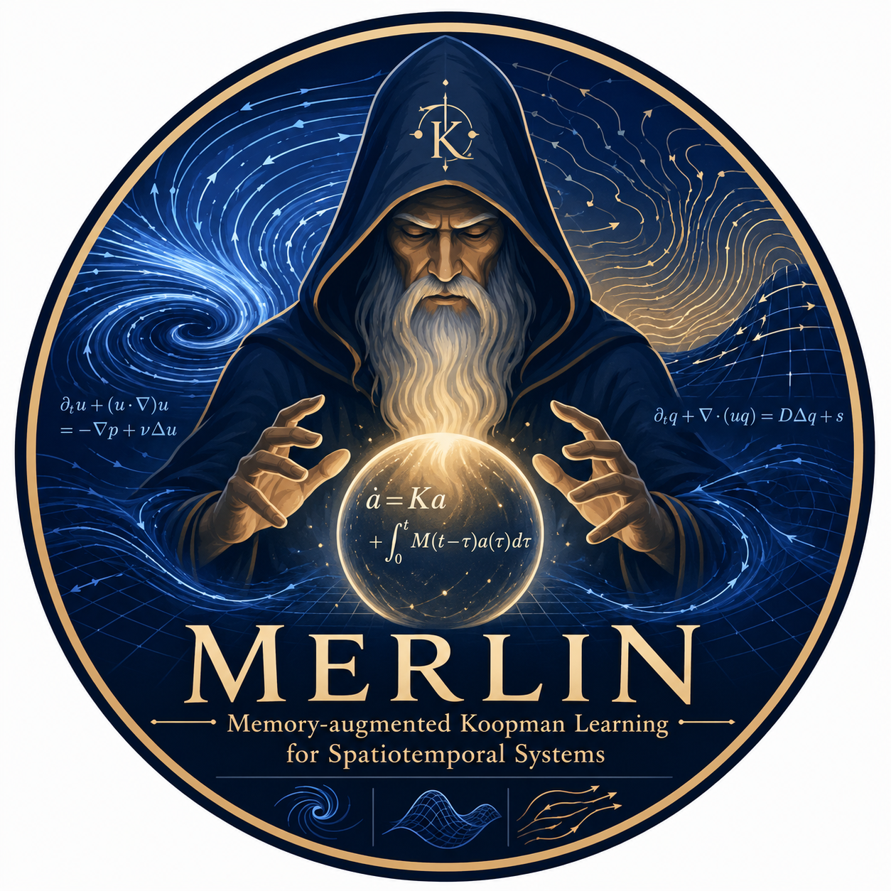
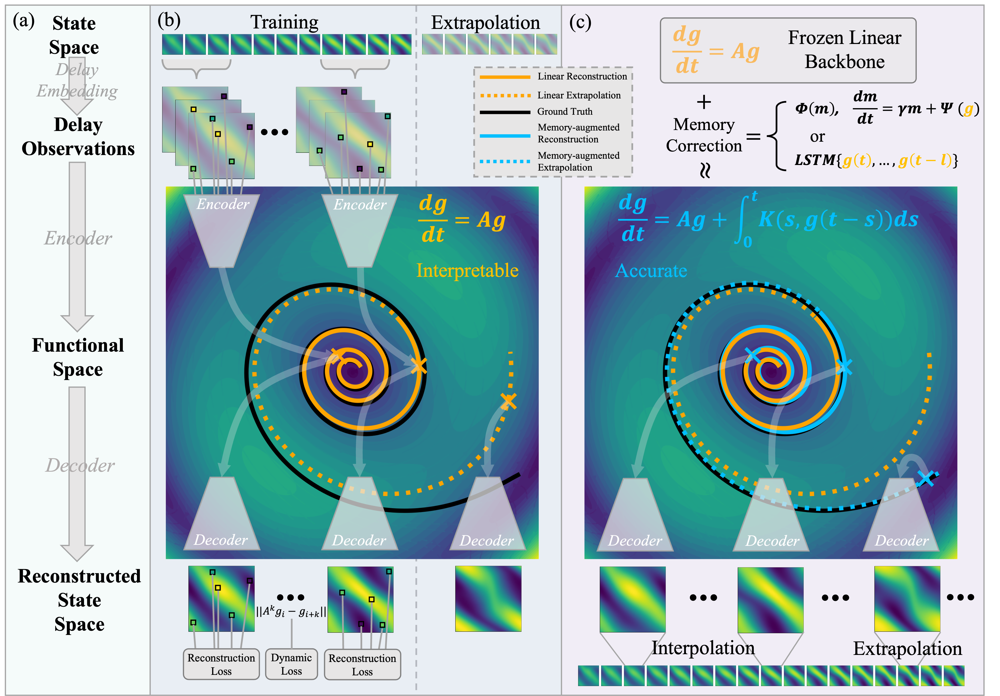

<p align="center">
  
</p>

<h1 align="center">Interpretable Functional Koopman Learning with Non-Markovian Closure for Spatiotemporal Systems</h1>

<p align="center">
  Accepted at ICML 2026 <b>(Spotlight, Top 2.2%)</b>
</p>

<p align="center">
  <a href="https://github.com/RobinLufdu">Wanfeng Lu</a><sup>*</sup> ·
  <a href="https://github.com/967255">He Ma</a><sup>*</sup> ·
  <a href="https://faculty.fudan.edu.cn/wlin/zh_CN/more/652043/jsjjgd/index.htm">Wei Lin</a><sup>†</sup>
  (<a href="https://scholar.google.com/citations?user=fw1oOqAAAAAJ&hl=en">Google Scholar</a>) ·
  <a href="https://qunxizhu.cn">Qunxi Zhu</a><sup>†</sup>
  (<a href="https://scholar.google.com/citations?user=45oFQD4AAAAJ&hl=en">Google Scholar</a>)
</p>

<p align="center">
  <sup>*</sup> Equal contribution &nbsp;&nbsp; <sup>†</sup> Corresponding author
</p>

<p align="center">
  <a href="https://icml.cc/virtual/2026/poster/61900"></a>
  
  
  <a href="LICENSE"></a>
</p>

MERLIN is a research codebase for learning compact latent representations of spatiotemporal fields and evolving them with a memory-aware latent process. The repository is organized around a two-stage training recipe: first learn a reconstruction-friendly latent space with a global latent linear backbone, then train a memory correction module for more accurate long-horizon rollouts.

## Framework

<p align="center">
  
</p>

## Highlights

- 🧠 **Functional Koopman learning** for PDE-driven spatiotemporal dynamics.
- 🌀 **Non-Markovian memory closure** inspired by Mori-Zwanzig theory.
- 🔭 **Random partial observations** with discretization-invariant function encoders.
- 🗺️ **Resolution-free reconstruction** for arbitrary query locations leveraging function decoders.
- ⚡ **Interpretable ROMs** with compact Koopman observables.

## Repository Tour

```text
MERLIN/
├── MERLIN/                         # Core model: function encoder, function decoder, attention modules, latent memory-augmented dynamics
├── exp/                            # Phase-I / Phase-II training, metrics, and visualization utilities
├── layers/                         # Neural operator and transformer building blocks (for baseline models)
├── utilities/                      # Data loaders, losses, normalizers, logging, checkpoint builders
├── data/
│   ├── data_process.py             # PDEDataProcessor and data split construction
│   └── wave/                       # Wave data generation
├── scripts/
│   ├── demo_phase1.sh              # Learn function encoder-decoder together with the linear backbone
│   ├── demo_phase2.sh              # Train the non-Markovian memory closure with fixed linear backbone
│   ├── demo_rom.sh                 # Train a low-dimensional ROM projector
│   └── demo_mask.sh                # Random partial-observation experiment
├── run_merlin.py                   # Main training entry point
├── eval_merlin.py                  # Evaluation, rollout export, and further downstream visualizations for interpretability
└── config.py                       # Dataset and model configuration factories
```

## Installation

MERLIN is implemented in PyTorch. We recommend the following setup:

```bash
conda create -n merlin python=3.10 -y
conda activate merlin

# Install PyTorch 2.8+ for your CUDA version:
# https://pytorch.org/get-started/locally/
pip install torch torchvision

pip install numpy scipy h5py einops timm matplotlib imageio sympy
```


## 📦 Data Preparation

🧭 All datasets are expected under `data/`. The exact paths are defined in `config.py`, so the file names below matter.

```text
data/
├── ns_V1e-3_N5000_T50.mat      # Navier-Stokes, viscosity 1e-3
├── wave.h5                     # Generated 2D wave trajectories
└── sst_T20_N1000.pt            # Processed SST benchmark
```

| Dataset key | How to prepare it | Loader convention |
| --- | --- | --- |
| `ns_1e-3` | Download `ns_V1e-3_N5000_T50.mat` from [this Google Drive folder](https://drive.google.com/drive/folders/1UnbQh2WWc6knEHbLn-ZaXrKUZhp7pjt-) and place it at `data/ns_V1e-3_N5000_T50.mat`. | Loaded from MATLAB key `u`, then reshaped to `[N, T, 1, H, W]`. |
| `wave` | Generate directly with `python data/wave/wave_generate.py`; the script writes `data/wave.h5`. | HDF5 dataset `data`, read as `[N, T, H, W, C]` and permuted to `[N, T, C, H, W]`. |
| `sst` | The SST benchmark follows: daily fields from the [CMEMS Global Ocean Physics Reanalysis](https://data.marine.copernicus.eu/product/GLOBAL_MULTIYEAR_PHY_001_030/description), an eddy-resolving 1/12-degree global product, cropped to a fixed oceanic box and split into four non-overlapping `64 x 64` tiles. | Store the processed tensor dict at `data/sst_T20_N1000.pt` with key `data`. |

For the wave generator, install the optional simulation dependencies if your environment does not already have them:

```bash
pip install py-pde tqdm
python data/wave/wave_generate.py
```

To add a new dataset, extend `_CFG_TABLE` in `config.py` and add a loading branch in `run_merlin.py` and `utilities/builder.py`.

## 🚀 Quick Start

### 1. Phase I: learn functional Koopman observables with near-linear latent evolution

Phase I learns the function encoder/decoder while fitting a global one-step latent linear backbone. The saved `Ad_phase1.pt` stores this discrete linear backbone, and the resulting latent coordinates are encouraged to behave as a compact set of observation functionals with approximately linear evolution.

```bash
python run_merlin.py \
  --phase phase1 \
  --gpu 0 \
  --dataset ns_1e-3 \
  --limit_trajs 1000 \
  --n_train_trajs 800 \
  --n_test_trajs 200 \
  --n_samples_per_traj 4 \
  --train_bs 16 \
  --test_bs 32 \
  --n_frames_cond 3 \
  --sample_strategy random \
  --fourier_hidden_dim 128 \
  --n_fourier_layers 4 \
  --token_dim 16 \
  --latent_tokens 8 \
  --enc_mode galerkin_transformer \
  --epochs 800 \
  --lr_phase1 1e-3 \
  --lambda_dyn 0.05 \
  --lambda_pred 0.1 \
  --ridge 0.005 \
  --ema_beta 0.97 \
  --log_every 5 \
  --eval_every 5
```

Phase-I runs are timestamped under `results/MERLIN/<dataset>/<run_id>/`:

```text
results/MERLIN/<dataset>/<run_id>/
├── phase1_best_rec.pth
├── phase1_final.pth
├── Ad_phase1.pt
├── split_metadata.json
├── log
└── configs/
    ├── dataloader_cfg.json
    ├── exp_cfg.json
    ├── model_cfg.json
    └── normalizer.pt
```

You can also start from the template:

```bash
bash scripts/demo_phase1.sh
```

### 🌀 2. Phase II: train the memory closure inspired by Mori-Zwanzig theory

Phase II freezes the Phase-I representation, initializes from `phase1_best_rec.pth`, and learns a non-Markovian correction on top of the linear latent backbone.

```bash
PHASE1_RUN=results/MERLIN/ns_1e-3/<phase1_run_id>

python run_merlin.py \
  --phase phase2 \
  --phase1_path "$PHASE1_RUN" \
  --gpu 0 \
  --dataset ns_1e-3 \
  --n_frames_train 10 \
  --n_frames_out 10 \
  --n_frames_cond 3 \
  --memory_dim 128 \
  --memory_type residual \
  --context_window 4 \
  --augment \
  --augment_variant history \
  --epochs 500 \
  --lr_dyn_mem 1e-3 \
  --lambda_corr 0.01 \
  --lambda_residual 1.0 \
  --scheduler StepLR \
  --step_size 50 \
  --gamma 0.8 \
  --log_every 5 \
  --eval_every 25
```

The script template below follows the same Phase-II workflow and includes both FMM and LMM variants. A completed Phase-II run writes `model_tr_best.pth`, `model_ts_best.pth`, `final_model.pth`, `split_metadata.json`, saved configs, and a run log.

```bash
bash scripts/demo_phase2.sh
```

### 🔬 3. Train an interpretable ROM

The ROM path learns a low-dimensional projector `U_proj` after Phase I, then trains memory dynamics in the projected latent coordinates. The resulting reduced-order model provides a compact and interpretable representation for inspecting Koopman modes and revealing the intrinsic low-dimensional structure of infinite-dimensional PDE dynamics.

```bash
PHASE1_RUN=results/MERLIN/ns_1e-3/<phase1_run_id>

python run_merlin.py \
  --phase phase2 \
  --phase1_path "$PHASE1_RUN" \
  --dataset ns_1e-3 \
  --train_proj \
  --d 16 \
  --proj_epochs 100 \
  --lr_proj 0.01 \
  --lr_dec_proj 1e-4 \
  --lam_dyn_proj 0.05 \
  --lam_ortho 0.05 \
  --memory_dim 128 \
  --memory_type leaky \
  --epochs 500
```

ROM runs are saved under `results/MERLIN/<dataset>/d=<d>/<run_id>/` and include `U_proj_d<d>.pt`. The corresponding script template is:

```bash
bash scripts/demo_rom.sh
```

### ✨ 4. Evaluate, visualize, and inspect

Use `eval_merlin.py` for both numerical metrics and interpretability artifacts.

```bash
PHASE1_RUN=results/MERLIN/ns_1e-3/<phase1_run_id>
PHASE2_RUN=results/MERLIN/ns_1e-3/<phase2_run_id>

python eval_merlin.py \
  --phase1_path "$PHASE1_RUN" \
  --model_path "$PHASE2_RUN" \
  --dataset ns_1e-3 \
  --gpu 0 \
  --rollout_steps 15 \
  --seq_id 0 \
  --traj_id 909 \
  --t0 12
```

For a ROM checkpoint:

```bash
ROM_RUN=results/MERLIN/ns_1e-3/d=16/<rom_run_id>

python eval_merlin.py \
  --model_path "$ROM_RUN" \
  --dataset ns_1e-3 \
  --gpu 0 \
  --rom \
  --rollout_steps 15 \
  --traj_id 909 \
  --t0 12
```

Evaluation writes into the selected run directory. The most useful outputs are:

| Output | What it tells you |
| --- | --- |
| `metrics_train.json`, `metrics_test.json` | 📊 Relative error, MSE, and RMSE, each split into full horizon, training-horizon, and test-horizon. |
| `vis/phase1/` | 🧲 Phase-I linear backbone rollout and `Ad` spectrum plots, including eigenvalue geometry. |
| `vis/phase2/` | 🎞️ Memory-augmented rollout GIFs for random and indexed trajectories. |
| `saved_tensors/phase1/`, `saved_tensors/phase2/` | 🧰 Prediction, ground truth, masks, and full trajectories for downstream plotting. |
| `latent/linear_vs_memory/` | 🔍 Linear-vs-memory energy statistics and latent evolution plots, the main interpretability view. |
| `rom/latent_modes/` | 🧬 Low-dimensional ROM coordinate time series and exported data tables. |

The evaluation pipeline supports more than temporal rollout: it reports forecasting errors, compares the linear backbone against the memory closure, inspects the spectrum of the learned Koopman operator, exports tensors for custom analysis, and visualizes reduced latent coordinates.

## 🍳 Common Recipes

### Run with masked spatial observations

```bash
python run_merlin.py \
  --phase phase1 \
  --dataset ns_1e-3 \
  --mask_ratio 0.5 \
  --block_size 2,2 \
  --epochs 500
```

Masked runs are saved under `results/MERLIN/<dataset>/mask<ratio>/`.

The script version is:

```bash
bash scripts/demo_mask.sh
```

### 🧠 Choose a memory module

MERLIN includes two main Mori-Zwanzig-inspired memory closures in the release scripts:

- **Finite Memory Module (FMM)**: use `--memory_type residual`. This module predicts the latent correction from a fixed window of recent latent states. Useful controls include `--context_window`, `--window_pad`, `--augment`, `--augment_variant`, and `--rnn_hidden`.
- **Leaky Memory Module (LMM)**: use `--memory_type leaky`. This module maintains a decaying memory state and decodes it into a correction to the linear backbone. Useful controls include `--memory_dim`, `--memory_enc_hidden_dim`, `--memory_dec_hidden_dim`, `--memory_enc_layers`, and `--memory_dec_layers`.

### Switch the encoder

```bash
python run_merlin.py \
  --phase phase1 \
  --dataset ns_1e-3 \
  --enc_mode set_transformer
```

Valid encoder modes are:

- `galerkin_transformer`
- `set_transformer`

### Evaluate only the Phase-I linear backbone

```bash
python eval_merlin.py \
  --phase1_path "$PHASE1_RUN" \
  --model_path "$PHASE2_RUN" \
  --dataset ns_1e-3 \
  --eval_mode phase1 \
  --rollout_steps 15
```

## Script Templates

The `scripts/` directory contains compact launch templates for the main paper-style workflows:

```text
scripts/demo_phase1.sh
scripts/demo_phase2.sh
scripts/demo_rom.sh
scripts/demo_mask.sh
```

For full control, call `run_merlin.py` directly. For quick reproducibility, edit the variables at the top of the corresponding script.

## 🧩 Important Arguments

| Argument | Meaning |
| --- | --- |
| `--phase` | `phase1` or `phase2` training |
| `--phase1_path` | Required for Phase II; points to a completed Phase-I run |
| `--dataset` | Dataset key from `config.py` |
| `--n_frames_cond` | Number of conditioning frames |
| `--n_frames_train` / `--n_frames_out` | Training and rollout horizon settings |
| `--latent_tokens` / `--token_dim` | Controls latent space dimension: `latent_dim = latent_tokens * token_dim` |
| `--enc_mode` | Encoder family |
| `--memory_type` | Latent memory backend, e.g. `leaky`, `residual` |
| `--memory_dim` | Dimension of the memory state used by memory backends such as LMM |
| `--mask_ratio` | Spatial missingness ratio |
| `--train_proj` / `--d` | Enable ROM projector training and set the projected dimension |
| `--rom` | ROM-aware evaluation mode in `eval_merlin.py` |


Run the full CLI reference with:

```bash
python run_merlin.py --help
python eval_merlin.py --help
```


## Citation

The paper appears in the Proceedings of the 43rd International Conference on Machine Learning (ICML 2026).

```bibtex
@inproceedings{lu2026merlin,
  title     = {Interpretable Functional Koopman Learning with Non-Markovian Closure for Spatiotemporal Systems},
  author    = {Lu, Wanfeng and Ma, He and Lin, Wei and Zhu, Qunxi},
  booktitle = {Proceedings of the 43rd International Conference on Machine Learning},
  year      = {2026},
  series    = {Proceedings of Machine Learning Research},
  volume    = {306}
}
```
